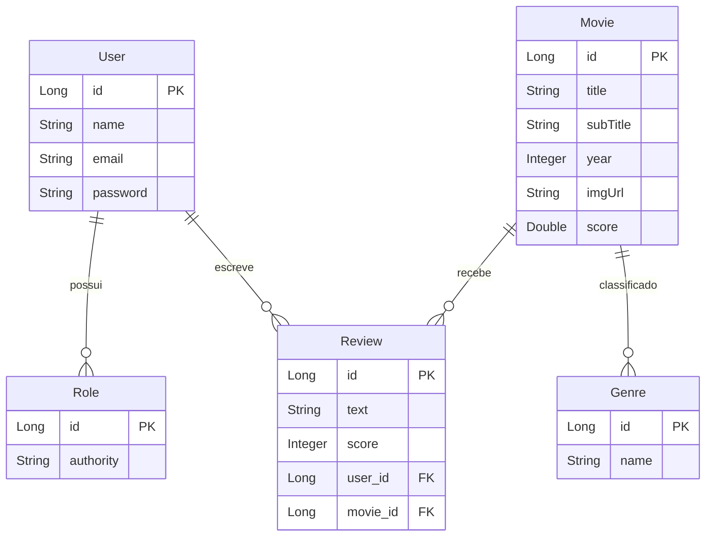

# Desafio DevSuperior - MovieFlix

[](https://openjdk.org/projects/jdk/17/)
[](https://spring.io/projects/spring-boot)
[](https://spring.io/projects/spring-security)
[](https://jwt.io/)
[](https://hibernate.org/)
[](https://www.postgresql.org/)
[](https://github.com/Jacques-Trevia/desafio-movieflix/blob/main/LICENSE)

## 📖 Sobre o Projeto

Este repositório contém a resolução de um **desafio avançado** do curso **Java Spring Expert** da DevSuperior. O projeto **MovieFlix** é uma API completa para um sistema de catálogo de filmes, similar a uma plataforma de streaming, que consolida diversos conceitos avançados:

- **Casos de uso complexos**: navegação por gêneros, avaliações de filmes, histórico do usuário
- **Sistema de cadastro (signup)**: criação de novos usuários com perfis específicos
- **Segurança avançada**: OAuth2, JWT, controle de acesso baseado em roles (VISITOR, MEMBER)
- **Relacionamentos complexos**: Movie ↔ Genre, Review ↔ User, User ↔ Role
- **Consultas personalizadas**: JPQL com joins, projeções, paginação
- **Finalização da aplicação**: Tratamento de erros, validações, documentação

## 🎯 Objetivo do Desafio

Aprender na prática como:
- Implementar **casos de uso reais** de uma aplicação de catálogo
- Criar um **sistema de cadastro de usuários (signup)** com validações e roles
- Controlar **acesso a recursos** baseado em perfil (MEMBER pode avaliar, VISITOR apenas consulta)
- Implementar **consultas complexas** com Spring Data JPA (busca de filmes por gênero, avaliações de um filme)
- Estruturar uma aplicação **seguindo boas práticas** de camadas e injeção de dependência

## ✨ Funcionalidades

### Gestão de Usuários
- **Cadastro (signup)**: Criação de novos usuários com perfil MEMBER
- **Busca de perfil**: Endpoint para obter informações do usuário logado
- **Roles**: VISITOR (não autenticado) e MEMBER (autenticado)

### Gestão de Filmes
- **Listagem paginada de filmes**: Com filtro opcional por gênero
- **Busca de filme por ID**: Incluindo detalhes completos
- **Visualização de avaliações**: Cada filme retorna suas avaliações

### Sistema de Avaliações
- **MEMBER pode avaliar filmes**: Nota e texto da avaliação
- **Um membro só pode avaliar o mesmo filme uma vez**
- **Atualização automática da pontuação média do filme**

### Gestão de Gêneros
- **Listagem de todos os gêneros**: Para uso em filtros

## 🚀 Tecnologias Utilizadas

- **Java 17**: Linguagem de programação.
- **Spring Boot 2.7.x**: Framework principal.
- **Spring Security + OAuth2**: Autenticação e autorização.
- **JWT**: JSON Web Tokens para tokens stateless.
- **Spring Data JPA**: Abstração para acesso a dados.
- **Hibernate**: Implementação do JPA.
- **PostgreSQL**: Banco de dados relacional em produção.
- **H2 Database**: Banco de dados em memória para testes.
- **Bean Validation**: Validação de dados.
- **Postman**: Teste da API (coleção e environment incluídos).
- **Maven**: Gerenciador de dependências.

## 📁 Estrutura do Projeto
```
src/
├── main/
│ ├── java/com/jacques/desafiomovieflix/
│ │ ├── DesafioMovieflixApplication.java # Classe principal
│ │ ├── config/ # Configurações de segurança
│ │ │ ├── AuthorizationServerConfig.java
│ │ │ ├── ResourceServerConfig.java
│ │ │ └── WebSecurityConfig.java
│ │ ├── controllers/ # Endpoints REST
│ │ │ ├── UserController.java
│ │ │ ├── MovieController.java
│ │ │ ├── GenreController.java
│ │ │ └── ReviewController.java
│ │ ├── dto/ # Objetos de transferência
│ │ │ ├── UserDTO.java
│ │ │ ├── UserInsertDTO.java
│ │ │ ├── MovieDTO.java
│ │ │ ├── GenreDTO.java
│ │ │ ├── ReviewDTO.java
│ │ │ └── (outros DTOs)
│ │ ├── entities/ # Entidades JPA
│ │ │ ├── User.java
│ │ │ ├── Role.java
│ │ │ ├── Movie.java
│ │ │ ├── Genre.java
│ │ │ └── Review.java
│ │ ├── repositories/ # Camada de acesso a dados
│ │ │ ├── UserRepository.java
│ │ │ ├── MovieRepository.java
│ │ │ ├── GenreRepository.java
│ │ │ └── ReviewRepository.java
│ │ ├── services/ # Camada de negócio
│ │ │ ├── UserService.java
│ │ │ ├── MovieService.java
│ │ │ ├── GenreService.java
│ │ │ ├── ReviewService.java
│ │ │ ├── AuthService.java
│ │ │ └── exceptions/ # Tratamento de exceções
│ │ │ ├── ResourceNotFoundException.java
│ │ │ ├── UnauthorizedException.java
│ │ │ └── ResourceExceptionHandler.java
│ │ └── validation/ # Validações customizadas
│ └── resources/
│ ├── application.properties # Configurações da aplicação
│ └── import.sql # Dados de teste
└── test/ # Testes unitários e de integração
```

## 🗺️ Modelo de Domínio



Relacionamentos:

User → Role: ManyToMany (VISITOR, MEMBER)

User → Review: OneToMany (um usuário pode escrever várias avaliações)

Movie → Review: OneToMany (um filme pode ter várias avaliações)

Movie → Genre: ManyToMany (um filme pode ter vários gêneros)

Review → User/Movie: ManyToOne (cada avaliação pertence a um usuário e um filme)

## 🔐 Perfis de Acesso
```
Perfil	Descrição	Permissões
VISITOR	Usuário não autenticado	Apenas consulta de filmes e gêneros
MEMBER	Usuário autenticado	Consulta + avaliação de filmes
ADMIN	(se implementado)	Gestão completa de filmes, gêneros e usuários
```

## ▶️ Como Executar o Projeto
Pré-requisitos
JDK 17 ou superior

Maven (ou utilizar o wrapper ./mvnw)

PostgreSQL instalado (ou Docker com PostgreSQL)

Passos
Clone o repositório:

bash
```
git clone https://github.com/Jacques-Trevia/desafio-movieflix.git
cd desafio-movieflix
```
Configure o banco de dados:

Crie um banco PostgreSQL (ex: movieflix)

Configure application.properties:

properties
```
spring.datasource.url=jdbc:postgresql://localhost:5432/movieflix
spring.datasource.username=seu_usuario
spring.datasource.password=sua_senha
```
Execute o projeto:

bash
```
./mvnw spring-boot:run
```
A API estará disponível em http://localhost:8080.

## 🔌 Endpoints da API

Autenticação e Usuários
```
Método	Endpoint	Permissão	Descrição
POST	/oauth/token	Público	Obter token JWT
POST	/users	Público	Cadastro de novo usuário (signup)
GET	/users/profile	MEMBER	Buscar perfil do usuário logado
```
Gêneros
```
Método	Endpoint	Permissão	Descrição
GET	/genres	Público	Listar todos os gêneros
```
Filmes
```
Método	Endpoint	Permissão	Descrição
GET	/movies	Público	Listar filmes paginados (filtro por genreId)
GET	/movies/{id}	Público	Buscar filme por ID (com avaliações)
```
Avaliações
```
Método	Endpoint	Permissão	Descrição
POST	/reviews	MEMBER	Adicionar avaliação a um filme
```

## 📊 Exemplos de Consultas (Repository)
Buscar filmes com filtro por gênero
```
public interface MovieRepository extends JpaRepository<Movie, Long> {
    
    @Query("SELECT DISTINCT m FROM Movie m " +
           "LEFT JOIN m.genres g " +
           "WHERE (:genreId IS NULL OR g.id = :genreId) " +
           "ORDER BY m.title")
    Page<Movie> findMoviesByGenre(@Param("genreId") Long genreId, Pageable pageable);
}
```
Buscar avaliações de um filme com dados do usuário
```
public interface ReviewRepository extends JpaRepository<Review, Long> {
    
    @Query("SELECT new com.jacques.desafiomovieflix.dto.ReviewDTO(r, u) " +
           "FROM Review r " +
           "JOIN r.user u " +
           "WHERE r.movie.id = :movieId")
    List<ReviewDTO> findReviewsByMovieId(@Param("movieId") Long movieId);
}
```

## 📦 Como Testar a API (Postman)
O repositório inclui os arquivos essenciais para testes:

```
Desafio Movieflix casos de uso.postman_collection.json: Coleção completa

Movieflix env.postman_environment.json: Environment configurado
```

Fluxo de Teste Completo:

Cadastrar novo usuário (signup):
```
json
POST /users
{
    "name": "João Silva",
    "email": "joao@email.com",
    "password": "123456"
}
```
Obter token:
```
POST /oauth/token
username: joao@email.com
password: 123456
grant_type: password
```
Listar gêneros:
```
GET /genres
```
Listar filmes (filtrando por gênero):
```
GET /movies?genreId=1&page=0&size=10
```
Buscar detalhes de um filme:
```
GET /movies/1
```
Avaliar um filme (MEMBER only):
```
json
POST /reviews
{
    "text": "Excelente filme!",
    "score": 5,
    "movieId": 1
}
```

## 🧪 Casos de Uso Implementados
UC01 - Cadastro de usuário: Qualquer pessoa pode se cadastrar (perfil MEMBER)

UC02 - Autenticação: Login gera token JWT válido por tempo determinado

UC03 - Visualizar catálogo de filmes: Usuário não autenticado pode ver filmes

UC04 - Filtrar filmes por gênero: Filtro opcional na listagem paginada

UC05 - Visualizar detalhes do filme: Inclui título, ano, sinopse, pontuação média

UC06 - Avaliar filme: Apenas MEMBER pode avaliar, uma única vez por filme

UC07 - Ver avaliações de um filme: Qualquer usuário pode ver avaliações

UC08 - Perfil do usuário: MEMBER pode visualizar seus dados

## 📚 Aprendizados
Este desafio permitiu praticar:

✅ Modelagem de domínio rico com relacionamentos complexos (ManyToMany, OneToMany)

✅ Casos de uso reais de uma aplicação de catálogo/streaming

✅ Sistema de cadastro (signup) com validações e roles padrão

✅ Segurança avançada: OAuth2, JWT, controle por perfil

✅ Consultas JPQL com joins, filtros dinâmicos e projeções

✅ Paginação e ordenação com Spring Data JPA

✅ Regras de negócio: Um membro só pode avaliar o mesmo filme uma vez

✅ Atualização automática de pontuação média do filme após avaliação

✅ Tratamento de exceções e respostas padronizadas

---

## 📜 Licença

Este projeto é parte do curso da **DevSuperior** e tem propósito educacional.

---

## 👨‍💻 Autor

**Jacques Araujo Trevia Filho**

[](https://www.linkedin.com/in/jacques-trevia)
[](https://github.com/Jacques-Trevia)
